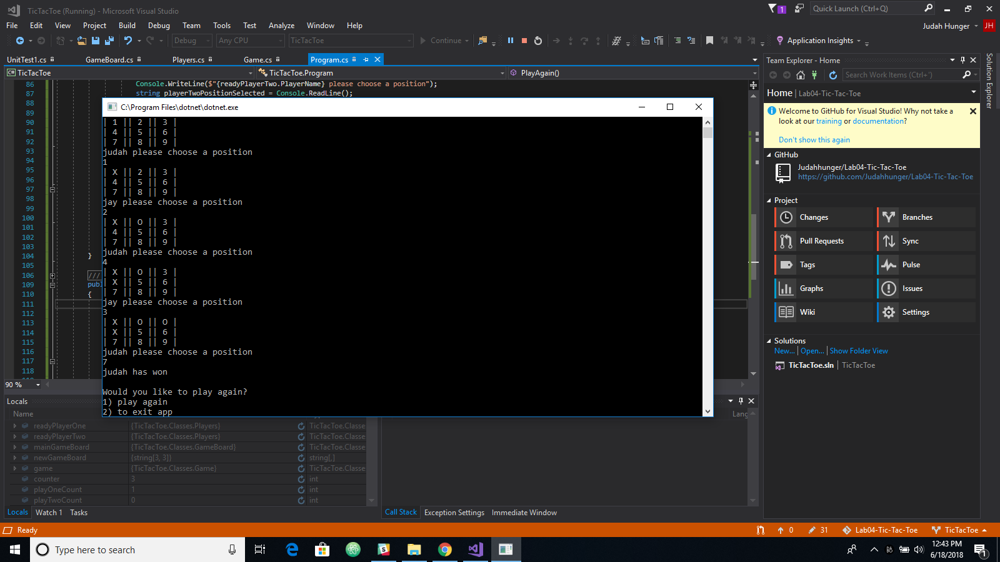

# Tic Tac Toe
**Author**: Judah Hunger
**Version**: 1.0.0

## Overview
- On start of app player one and player two put in names.
- Then start a game of tic tac toe.
- The first person to fill in 3 of the squares wins.

## Getting Started
- The following is required to run the program.
- 1. Visual Studio 2017 
- 2. The .NET desktop development workload enabled
- 3. No External NuGet packages are required for this application. 

## Example

- This application is created using ASP.NET Core 7.0 Console applicaitons. 
- Language: C# 
- Type of Applicaiton: Console Application 

## Change Log

06-18-2018 9:00pm - Added functionality to game and updated ReadMe.